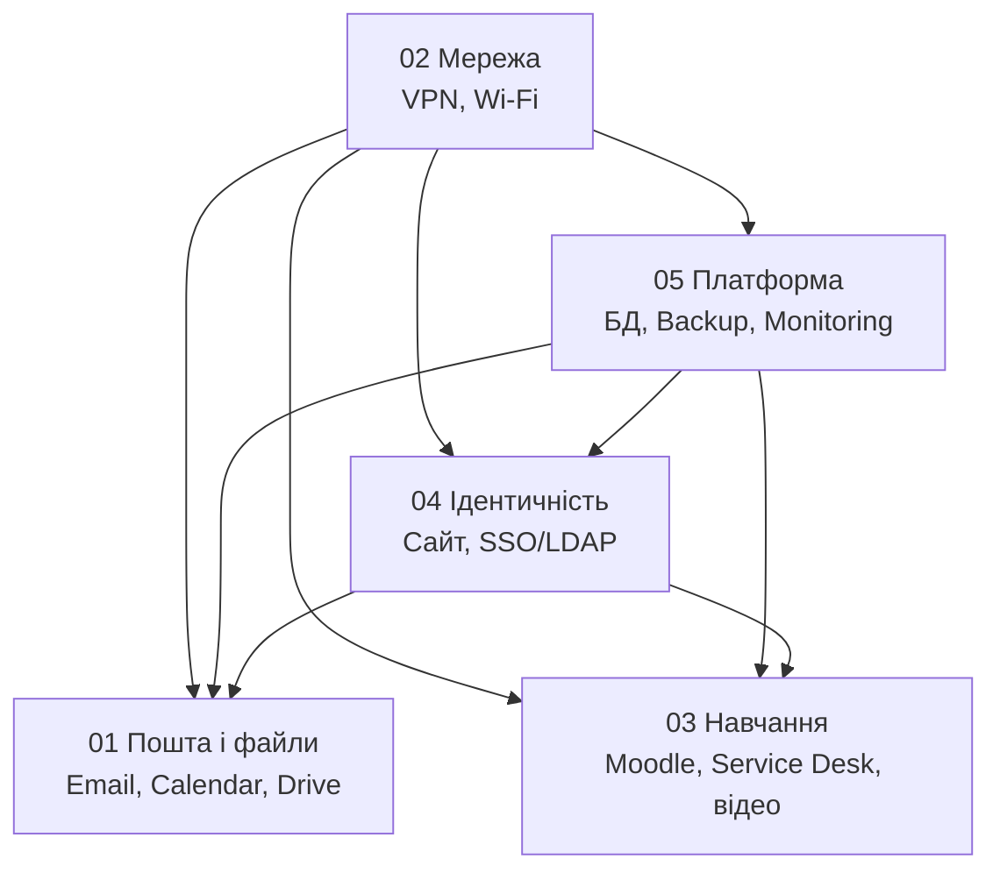

# Ескалація

## Граф залежностей

Стрілка означає «без цього не працює». Мережа лежить під усім: якщо впала вона, впаде все інше — і це буде виглядати як п'ять різних інцидентів у п'яти командах.

| Ваш сервіс | Симптом може походити від |
|---|---|
| 01 Пошта і файли | 02 Мережа, 04 SSO, 05 БД/Backup |
| 02 Мережа | 05 Monitoring (якщо проблема в тому, що ви її не бачите) |
| 03 Навчання | 02 Мережа, 04 SSO, 05 БД |
| 04 Ідентичність | 02 Мережа, 05 БД |
| 05 Платформа | 02 Мережа |

## Коли ескалювати

Ескалюйте, якщо **причина не у вашому сервісі**, і ви це показали фактами. Не «мабуть, це мережа», а «у наших логах SSO-відповіді 5 с при нормі 200 мс, з нашого боку конфігурація не змінювалася».

Ескалюйте також, якщо **не встигаєте в SLO** і потрібні руки. Це не визнання слабкості, це робота.

Не ескалюйте, щоб позбутися тікета. Тікет без діагностики повернеться.

## Як ескалювати

1. **Призначити** тікет команді, до якої ескалюєте (`assign`).
2. **Згадати** її в коментарі (`@lnu-itsm-2026/<ГРУПА>-network`).
3. Поставити мітку `esc:cross-team`.
4. У коментарі — **чотири речі**: що спостерігаєте, коли почалося, що вже перевірили, чому вважаєте, що причина в них.
5. Поставити мітку `status:waiting` — тікет не «в роботі» і не «закритий».

## Головне правило

**Ви лишаєтесь власником комунікації з користувачем**, поки він не отримав відповідь. Ескалація передає технічну роботу, не відповідальність перед користувачем.

«Ми передали в мережеву команду» — не відповідь користувачу. Відповідь: «Причина в мережевому обладнанні корпусу, колеги працюють, орієнтовно до 14:00, я напишу вам о 13:00 незалежно від результату».

Ескалація, після якої ви замовкли, у цьому курсі гірша за неескалацію: тікет закритий, користувач у невідомості, і бал за роль не нараховується.

## Що робити, якщо ескалювали до вас

- Прийняти або обґрунтовано відхилити протягом того ж SLO, що й для власного тікета такого пріоритету.
- Обґрунтовано відхилити — це показати, чому причина не у вас. Не «у нас усе працює».
- Якщо причина у вас — створити власний тікет або проблему й дати колегам строк, який вони зможуть передати користувачу.

## Ескалація до керівництва

Роль керівництва виконує викладач. Ескалювати до нього потрібно, якщо:

- інцидент **S1 або S2** (безпека) — негайно, без винятків;
- **P1** не буде відновлено в строк;
- потрібне рішення, яке ви не маєте права ухвалити: зупинити сервіс, повідомити користувачів про витік, витратити гроші;
- дві команди не можуть домовитися, чия це проблема.
